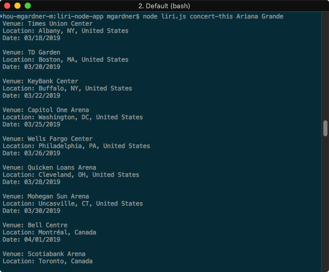
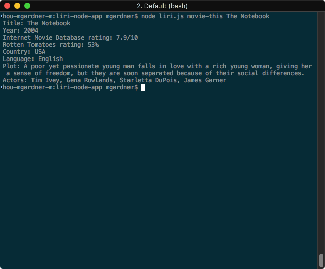
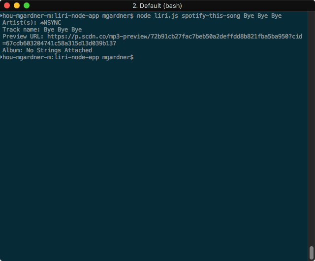
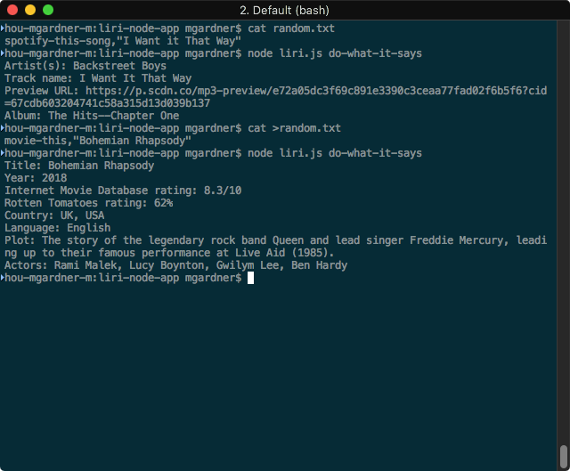

# liri-node-app
LIRI is a Language Interpretation and Recognition Interface.

To install it, type:

```
$ cd liri-node-app
$ npm install
```

To use it, type:

```
$ node liri.js <command> <thing>
```

...where *command* is one of:
* `concert-this`

  This takes an artist as *thing* and returns concert dates for that artist.
  Here's an example screenshot:
  

* `movie-this`

  This takes a movie title as *thing* and returns information about that
  movie.
  Here's an example screenshot:
  

  If you do not specify a movie title, information for the 2009 film
  _Mr. Nobody_ is displayed. According to our instructors, "If you haven't
  watched [_Mr. Nobody_](http://www.imdb.com/title/tt0485947/), then you
  should. It's on Netflix!"

* `spotify-this-song`

  This takes a song title as *thing* and returns information about that song.
  Here's an example screenshot:
  

  If you do not specify a song title, information for the song _The Sign_ by
  Ace of Base is displayed.

* `do-what-it-says`

  This takes a *command* and a *thing* from the comma-delimited file at
  `random.txt`, and runs that command. To change the output, change the
  contents of `random.txt`.
  Here's an example screenshot:
  
